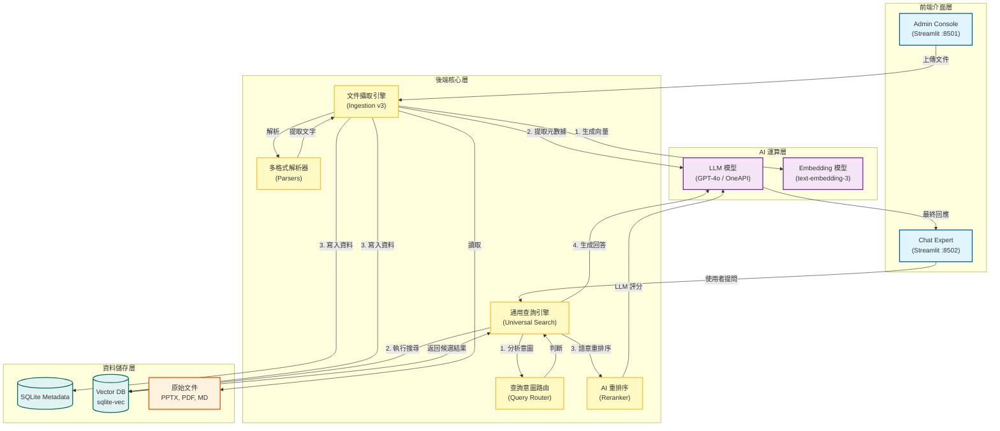
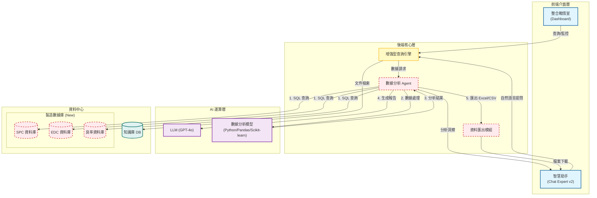

# AI Agent 系統架構流程圖

本文檔展示了 AI Agent 系統目前的架構流程與未來的擴展開發藍圖。

## 🏛️ 當前架構流程 (Current Architecture v1.5.0)

目前的系統以 RAG (檢索增強生成) 為核心，整合了 Admin 管理後台與 User 問答前台，並透過通用查詢引擎進行資料檢索。

---

## 🚀 未來架構藍圖 (Future Roadmap: SPC/EDC/Yield)

未來的系統將從單純的文件知識庫，擴展為整合生產數據 (SPC, EDC, Yield) 的全方位製造智慧平台。

### 關鍵擴充模組說明

1.  **製造數據庫 (Manufacturing Data Hub)**:
    -   **SPC DB**: 統計製程控制數據 (CPK, Control Charts)。
    -   **EDC DB**: 機台工程數據 (Sensor logs, FDC)。
    -   **Yield DB**: 產品良率數據、Defect Map。

2.  **數據分析 Agent (Data Agent)**:
    -   具備 SQL 生成能力，能將自然語言轉為資料庫查詢。
    -   整合 Pandas/Scikit-learn 進行趨勢分析與異常偵測。

3.  **資料匯出模組 (Exporter)**:
    -   自動生成 Excel 報表或 CSV 檔案供使用者下載。
