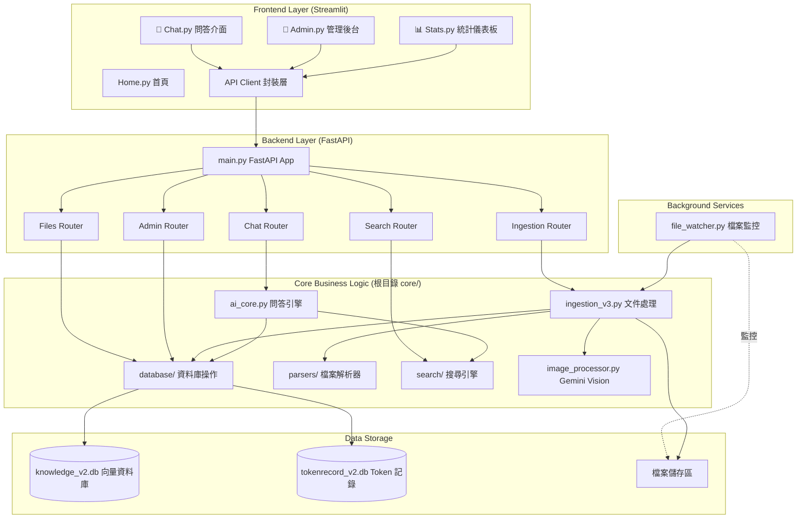
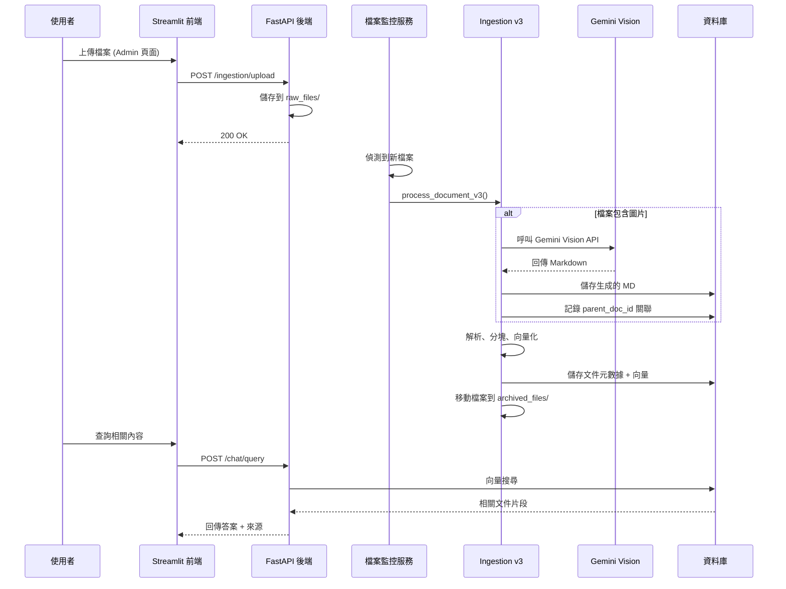
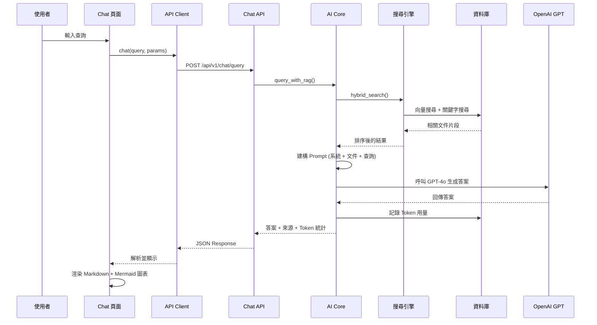
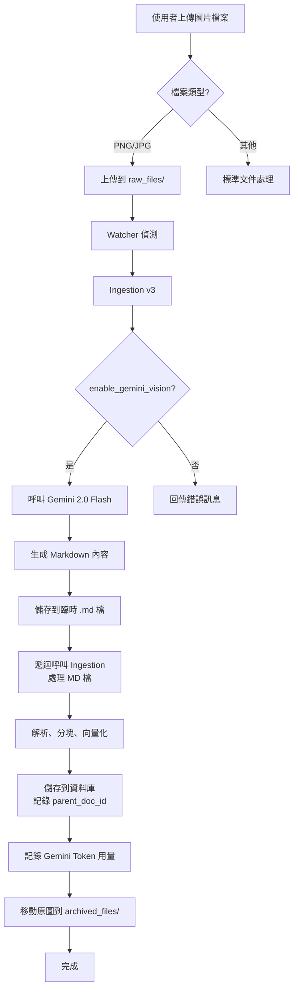

# AI Expert System v2.0 - 架構總覽

> **版本**: 2.0  
> **架構**: FastAPI (Backend) + Streamlit (Frontend)  
> **最後更新**: 2026-02-12

---

## 📐 系統架構圖



---

## 🏗️ 目錄結構與職責

### Backend (FastAPI 層)

```
backend/
├── app/
│   ├── main.py                    # FastAPI 應用入口、生命週期管理
│   ├── dependencies.py            # 依賴注入 (sys.path、core 模組)
│   ├── api/v1/                    # API 路由模組
│   │   ├── chat.py                # 問答 API (2 端點)
│   │   ├── ingestion.py           # 檔案上傳/處理 API (3 端點)
│   │   ├── files.py               # 檔案下載/管理 API (2 端點)
│   │   ├── admin.py               # 管理功能 API (7 端點)
│   │   └── search.py              # 搜尋 API (2 端點)
│   ├── core/
│   │   └── image_processor.py     # Gemini Vision 處理器
│   ├── services/
│   │   └── file_watcher.py        # Watchdog 檔案監控服務
│   ├── schemas/                   # Pydantic 資料模型
│   │   ├── chat.py
│   │   ├── document.py
│   │   └── common.py
│   ├── middleware/                # 中介層
│   │   ├── cors.py                # CORS 設定
│   │   └── token_tracker.py       # Token 使用追蹤
│   └── utils/
│       └── file_handler.py        # 檔案操作工具
├── data/                          # 資料儲存區
│   ├── documents/                 # 資料庫檔案
│   │   ├── knowledge_v2.db
│   │   └── tokenrecord_v2.db
│   ├── raw_files/                 # 原始檔案監控區 (Input)
│   ├── archived_files/            # 已處理檔案歸檔 (Output)
│   ├── generated_md/              # Gemini 生成 Markdown
│   └── failed_files/              # 處理失敗檔案
├── tests/                         # 自動化測試
│   ├── test_api.py                # API 端點測試
│   ├── test_watcher.py            # 檔案監控測試
│   ├── test_image_processor.py    # Gemini 處理器測試
│   └── test_ingestion.py          # 入庫流程測試
├── config.py                      # 後端配置
└── requirements.txt               # 後端依賴

職責:
- HTTP 請求處理與路由
- 背景服務管理 (Watcher)
- API 文檔自動生成 (/docs)
- 靜態檔案服務 (/files/)
```

### Frontend (Streamlit 層)

```
frontend/
├── Home.py                        # 應用入口、系統狀態
├── pages/                         # 多頁面應用
│   ├── 1_💬_Chat.py               # 問答介面 (9 項 UI 優化)
│   ├── 2_📁_Admin.py              # 檔案管理、批次操作
│   └── 3_📊_Stats.py              # 統計儀表板 (Plotly 圖表)
├── client/
│   └── api_client.py              # API 客戶端封裝 (16 方法)
├── components/                    # 可重用 UI 組件
│   ├── chat_ui.py                 # 聊天組件 (卡片、8D 報告)
│   └── uploader.py                # 拖拽上傳組件
├── utils/
│   └── markdown_renderer.py       # Markdown/Mermaid 渲染
├── config.py                      # 前端配置 (API URL)
└── requirements.txt               # 前端依賴

職責:
- 使用者介面呈現
- 使用者互動處理
- 透過 HTTPx 調用後端 API
- 前端狀態管理 (session_state)
```

### Core (核心業務邏輯)

```
core/                              # 專案根目錄共享模組
├── ai_core.py                     # OpenAI 問答引擎
├── ingestion_v3.py                # 文件處理主流程 (✅ Gemini 已整合)
├── keyword_manager.py             # 關鍵字管理
├── metadata_extractor.py          # 元數據提取
├── database/                      # 資料庫模組
│   ├── document_db.py             # 文件 CRUD
│   ├── chunk_db.py                # 向量切片
│   ├── keyword_db.py              # 關鍵字索引
│   └── token_db.py                # Token 記錄
├── parsers/                       # 檔案解析器
│   ├── troubleshooting_parser.py  # 故障排除文件解析
│   ├── training_parser.py         # 訓練教材解析
│   ├── knowledge_parser.py        # 知識文件解析
│   └── procedure_parser.py        # 程序文件解析
├── search/                        # 搜尋引擎
│   ├── semantic_search.py         # 向量語意搜尋
│   ├── keyword_search.py          # 關鍵字搜尋
│   └── hybrid_search.py           # 混合搜尋
└── ppt_parser.py                  # PPT 解析 (含圖片提取)

職責:
- 業務邏輯實作 (與框架無關)
- 資料庫操作封裝
- AI 模型調用 (OpenAI, Gemini)
- 檔案解析與向量化
- 前後端共享邏輯 (透過 sys.path 引用)
```

---

## 🔄 核心資料流

### 1. 自動化入庫流程



### 2. 問答查詢流程



### 3. Gemini 圖片處理流程



---

## 🔌 API 端點總覽

### Chat API (`/api/v1/chat`)

| 方法 | 端點 | 功能 | 主要參數 |
|------|------|------|----------|
| POST | `/query` | 問答查詢 | query, query_type, search_params |
| GET | `/history` | 聊天歷史 | limit |

### Ingestion API (`/api/v1/ingestion`)

| 方法 | 端點 | 功能 | 主要參數 |
|------|------|------|----------|
| POST | `/upload` | 單檔上傳 | file, doc_type |
| POST | `/upload_multiple` | 批次上傳 | files[], doc_type |
| GET | `/status/{filename}` | 查詢處理狀態 | filename |

### Files API (`/api/v1/files`)

| 方法 | 端點 | 功能 | 主要參數 |
|------|------|------|----------|
| GET | `/list` | 列出所有檔案 | file_type (archived/generated) |
| GET | `/download/{filename}` | 檔案下載 | filename |

### Admin API (`/api/v1/admin`)

| 方法 | 端點 | 功能 | 主要參數 |
|------|------|------|----------|
| GET | `/config` | 取得系統配置 | - |
| POST | `/config` | 更新配置 | config_dict |
| GET | `/stats` | 統計資訊 | - |
| GET | `/documents` | 文件列表 | limit, offset |
| DELETE | `/documents/{id}` | 刪除文件 | doc_id |
| GET | `/token_stats` | Token 統計 | days |
| POST | `/batch/{action}` | 批次操作 | action (reindex/update/validate), doc_ids[] |

### Search API (`/api/v1/search`)

| 方法 | 端點 | 功能 | 主要參數 |
|------|------|------|----------|
| POST | `/semantic` | 語意搜尋 | query, top_k |
| POST | `/keyword` | 關鍵字搜尋 | keywords[], top_k |

---

## 🗄️ 資料庫架構

### knowledge_v2.db (SQLite + sqlite-vec)

#### 1. documents 表
```sql
CREATE TABLE documents (
    id INTEGER PRIMARY KEY AUTOINCREMENT,
    filename TEXT NOT NULL,
    doc_type TEXT,                  -- Knowledge/Troubleshooting/Training/Procedure
    analysis_mode TEXT,             -- text_only/vision/auto
    model_used TEXT,                -- gpt-4o/gpt-4o-mini/gemini-2.0-flash
    created_at TIMESTAMP,
    updated_at TIMESTAMP,
    file_size INTEGER,
    file_hash TEXT UNIQUE,
    processing_time REAL,
    
    -- 元數據欄位 (AI 自動提取)
    category TEXT,                  -- 分類
    tags TEXT,                      -- 標籤 (comma-separated)
    department TEXT,                -- 部門
    factory TEXT,                   -- 工廠
    priority INTEGER,               -- 優先級 (0-5)
    summary TEXT,                   -- 摘要
    key_points TEXT,                -- 重點 (JSON array)
    language TEXT,                  -- 語言
    
    -- Troubleshooting 專用欄位
    product_model TEXT,             -- 產品型號
    defect_code TEXT,               -- 缺陷代碼
    station TEXT,                   -- 站點
    yield_loss REAL,                -- 良率損失
    
    -- Gemini Vision 專用欄位 (✅ 新增)
    parent_doc_id INTEGER,          -- 父文件 ID (圖片生成 MD 關聯原圖)
    source_type TEXT,               -- original/gemini_generated
    
    FOREIGN KEY (parent_doc_id) REFERENCES documents(id)
);
```

#### 2. vec_chunks 表 (向量儲存)
```sql
CREATE VIRTUAL TABLE vec_chunks USING vec0(
    doc_id INTEGER,                 -- 關聯到 documents.id
    chunk_index INTEGER,
    content TEXT,
    embedding FLOAT[1536],          -- OpenAI text-embedding-3-small
    token_count INTEGER,
    keywords TEXT,                  -- 提取的關鍵字
    created_at TIMESTAMP
);
```

#### 3. document_keywords 表 (關鍵字索引)
```sql
CREATE TABLE document_keywords (
    id INTEGER PRIMARY KEY AUTOINCREMENT,
    doc_id INTEGER,
    keyword TEXT,
    weight REAL DEFAULT 1.0,        -- 關鍵字權重
    FOREIGN KEY (doc_id) REFERENCES documents(id)
);
CREATE INDEX idx_keyword ON document_keywords(keyword);
```

### tokenrecord_v2.db

#### token_usage 表
```sql
CREATE TABLE token_usage (
    id INTEGER PRIMARY KEY AUTOINCREMENT,
    file_name TEXT,
    operation TEXT,                 -- query/embedding/gemini_vision
    timestamp TIMESTAMP DEFAULT CURRENT_TIMESTAMP,
    prompt_tokens INTEGER,
    completion_tokens INTEGER,
    total_tokens INTEGER,
    model TEXT,                     -- gpt-4o/gemini-2.0-flash/text-embedding-3-small
    cost REAL                       -- 估算成本 (USD)
);
```

---

## 🛠️ 技術棧

### 後端
- **Web 框架**: FastAPI 0.109+
- **ASGI 伺服器**: Uvicorn
- **檔案監控**: Watchdog
- **AI 模型**:
  - OpenAI GPT-4o (問答生成)
  - OpenAI text-embedding-3-small (向量化)
  - Google Gemini 2.0 Flash (圖片辨識)
- **資料庫**: SQLite + sqlite-vec (向量擴展)
- **測試**: pytest, pytest-asyncio

### 前端
- **UI 框架**: Streamlit 1.30+
- **HTTP 客戶端**: httpx
- **圖表**: Plotly
- **Markdown 渲染**: streamlit-mermaid

### 共享
- **檔案解析**: python-pptx, PyMuPDF, Pillow
- **環境管理**: python-dotenv
- **錯誤重試**: tenacity
- **模糊搜尋**: RapidFuzz

---

## 🚀 啟動流程

### 1. 開發環境啟動

```bash
# 1. 安裝依賴
pip install -r backend/requirements.txt
pip install -r frontend/requirements.txt

# 2. 初始化資料庫
python scripts/init_db.py

# 3. 配置環境變數
copy .env.example .env
# 編輯 .env 填入 OPENAI_API_KEY, GEMINI_API_KEY

# 4. 啟動後端 (Terminal 1)
cd backend
set PYTHONPATH=..
uvicorn app.main:app --host 0.0.0.0 --port 8000 --reload

# 5. 啟動前端 (Terminal 2)
cd frontend
set PYTHONPATH=..
streamlit run Home.py --server.port 8501 --server.address 0.0.0.0

# 訪問:
# - 前端 UI: http://localhost:8501 (局域網: http://<本機IP>:8501)
# - 後端 API: http://localhost:8000
# - API 文檔: http://localhost:8000/docs
```

### 2. 一鍵啟動 (Windows)

```batch
start_v2.bat
```

**腳本功能**:
- ✅ 自動檢查 Python 環境
- ✅ 首次使用自動安裝依賴
- ✅ 建立必要的資料目錄
- ✅ 背景啟動後端 (Port 8000)
- ✅ 啟動前端 (Port 8501)
- ✅ 設定 PYTHONPATH 環境變數

---

## 🔐 安全性設計

### CORS 配置
- **允許來源**: `http://localhost:8501`, `http://<本機IP>:8501`
- **允許方法**: GET, POST, PUT, DELETE
- **允許標頭**: Content-Type, Authorization

### 檔案上傳限制
- **檔案大小**: 最大 50MB
- **允許類型**: `.md`, `.txt`, `.pptx`, `.pdf`, `.png`, `.jpg`, `.jpeg`
- **病毒掃描**: 待實作 (可整合 ClamAV)

### API 認證
- **當前狀態**: 無認證 (內部使用)
- **未來規劃**: JWT Token 認證、API Key 驗證

---

## 📊 效能指標

### 典型處理時間

| 操作 | 平均耗時 | 備註 |
|------|---------|------|
| 上傳檔案 (10MB PPT) | ~2 秒 | 儲存到 raw_files/ |
| Watcher 觸發 | ~1 秒 | Debounce 機制 |
| PPT 解析 (20 頁) | ~15 秒 | 含圖片提取 |
| Gemini 圖片辨識 (1 張) | ~3 秒 | 表格/流程圖轉 MD |
| 向量化 (100 chunks) | ~8 秒 | text-embedding-3-small |
| 語意搜尋 | ~500ms | 100 文件情境下 |
| GPT-4o 問答生成 | ~5 秒 | 含上下文注入 |

### 資料庫規模

| 項目 | 數量 | 備註 |
|------|------|------|
| 文件數 | ~500 | 實測環境 |
| 向量切片 | ~5,000 | 平均每文件 10 chunks |
| 資料庫大小 | ~800MB | knowledge_v2.db |
| Token 記錄 | ~10,000 筆 | 3 個月累積 |

---

## 🔧 維護與監控

### 日誌管理
- **位置**: `backend/data/logs/`
- **格式**: JSON Lines (每行一條日誌)
- **保留期限**: 30 天
- **日誌級別**:
  - INFO: 正常操作
  - WARNING: 非致命錯誤
  - ERROR: 需要介入的錯誤

### 健康檢查
- **端點**: `GET /health`
- **回應**:
  ```json
  {
    "status": "healthy",
    "database": "connected",
    "watcher": "running",
    "timestamp": "2026-02-12T20:00:00Z"
  }
  ```

### Token 用量監控
- **儀表板**: Stats 頁面 (Plotly 圖表)
- **追蹤項目**:
  - 每日 Token 消耗 (OpenAI + Gemini)
  - 成本估算 (USD)
  - 使用量趨勢分析

---

## 🐛 已知限制與改進方向

### 當前限制
1. **單一使用者**: 無多用戶權限管理
2. **無快取機制**: 重複查詢每次都呼叫 API
3. **同步處理**: Watcher 處理檔案時阻塞後續檔案
4. **Gemini 限流**: 未實作重試與降級機制

### 未來改進
- [ ] 實作 Redis 快取 (查詢結果、向量快取)
- [ ] 非同步檔案處理佇列 (Celery)
- [ ] 多租戶支援 (JWT 認證)
- [ ] WebSocket 即時進度推送
- [ ] Prometheus + Grafana 監控
- [ ] Docker 容器化部署

---

## 📚 相關文件

- [TODO.md](../TODO.md) - 待辦事項清單
- [backend/README.md](../backend/README.md) - 後端 API 詳細文檔
- [frontend/README.md](../frontend/README.md) - 前端組件說明
- [audit_report.md](../audit_report.md) - 專案稽核報告
- [optimization_summary.md](../optimization_summary.md) - 搜尋優化建議
- [generalization_proposal.md](../generalization_proposal.md) - 通用化方案

---

## 🤝 開發規範

### Git 提交訊息規範
```
<type>(<scope>): <subject>

type: feat, fix, docs, style, refactor, test, chore
scope: backend, frontend, core, docs
subject: 簡短描述 (繁體中文)
```

### 程式碼規範
- **Python**: PEP 8 (使用 black 格式化)
- **註解**: 繁體中文
- **Docstring**: Google Style
- **型別提示**: 所有函數必須有型別標註

### 測試規範
- **單元測試**: 覆蓋率 > 70%
- **整合測試**: 關鍵流程必須測試
- **測試命令**: `pytest backend/tests/ -v`

---

**版本歷史**:
- v2.0 (2026-02-12): 前後端分離、Gemini Vision 整合、UI 優化
- v1.5 (2025-12): 增強版 Ingestion、元數據自動提取
- v1.0 (2025-10): 初版 Streamlit 單體應用
