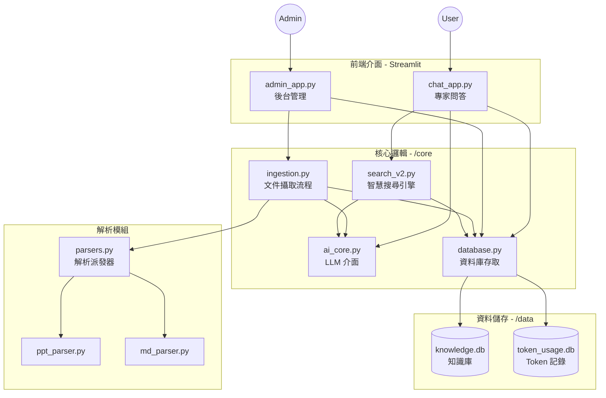

# AI Expert System v2.0

一個基於 RAG (Retrieval-Augmented Generation) 的企業級知識管理專家系統，支援多格式文件解析、知識庫分類管理與智慧問答。

## ✨ 主要功能

### 1. 多格式文件支援
- **支援格式**：PPTX, Markdown, Text, PDF
- **自動解析**：智慧提取文字、表格與圖片內容
- **結構化處理**：將非結構化文件轉為結構化知識單元

### 2. 專業知識分類 (v2.0 架構)
系統支援四種專屬文件類型，針對不同場景優化：
- **� 知識庫 (Knowledge)**：技術文件、手冊、教科書 (著重章節結構)
- **🎓 教育訓練 (Training)**：培訓教材、課程講義 (著重重點摘要)
- **� 日常手順 (Procedure)**：SOP、操作手冊 (著重步驟分解)
- **� 異常解析 (Troubleshooting)**：8D 報告、維修記錄 (著重問題分析與解決對策)

### 3. 雙介面設計
- **⚙️ 管理後台 (Admin Console)**：文件上傳、解析狀態監控、資料庫管理、Token 使用統計
- **� 專家問答 (Chat Expert)**：智慧搜尋、多輪對話、模糊比對糾錯、自動萃取關鍵字

### 4. 智慧搜尋引擎
- **多層級降級搜尋**：檔名搜尋 -> 關鍵字搜尋 -> 摘要搜尋 -> 全文搜尋
- **智慧萃取**：自動從自然語言中提取檔名或編號 (如 "N706 蝴蝶Mura")
- **模糊搜尋**：容忍拼寫錯誤，提升搜尋命中率

---

## 🚀 快速開始

### 1. 安裝依賴

```bash
pip install -r requirements.txt
```

### 2. 環境設定

複製 `.env.example` 為 `.env` 並填入您的設定 (或直接在 UI 設定)：

```bash
cp .env.example .env
```

### 3. 啟動系統

本系統分為兩個獨立介面，請依需求啟動：

**啟動管理後台 (Port 8501)**
```bash
streamlit run admin_app.py
```
用途：上傳文件、管理資料庫、查看統計報表。

**啟動問答介面 (Port 8502)**
```bash
streamlit run chat_app.py --server.port 8502
```
用途：一般使用者進行查詢與問答。

---

## 📖 使用流程

### Step 1: 建立知識庫 (管理後台)
1. 進入 **管理後台** (`admin_app.py`)
2. 在「文件上傳」頁籤，建立文件分類 (如：異常解析)
3. 輸入資料夾路徑，系統會自動掃描並解析所有支援的檔案
4. 等待處理完成

### Step 2: 查詢知識 (問答介面)
1. 進入 **專家問答** (`chat_app.py`)
2. (可選) 在側邊欄限定搜尋範圍 (如：只搜 "異常解析")
3. 輸入問題，例如：「請歸納 N706 的異常原因」
4. 系統將列出參考文件並生成 AI 回答

---

## 🛠️ 技術架構

### 系統模組關係圖 (System Architecture)



### 專案目錄結構 (File Structure)

```
ppt_expert_system/
├── admin_app.py           # 管理後台：負責文件上傳、解析排程與系統設定
├── chat_app.py            # 問答前台：負責使用者對話、搜尋與 AI 回答生成
├── config.py              # 全域配置：環境變數、路徑設定、Log 設定
│
├── core/                  # 核心模組
│   ├── database.py        # 資料存取層 (DAL)：統一處理 SQLite CRUD 操作
│   ├── search_v2.py       # 檢索層 (Retrieval)：實作多層級降級搜尋與模糊比對
│   ├── ingestion.py       # 攝取層 (Ingestion)：協調檔案掃描、解析與寫入流程
│   ├── ai_core.py         # AI 介面層：封裝 OpenAI/Compatible API 呼叫
│   │
│   # 解析器模組 (Parsers)
│   ├── parsers.py         # 解析派發器 (Factory)：根據副檔名選擇解析策略
│   ├── ppt_parser.py      # PPT 解析器：提取投影片文字、表格與圖片
│   └── md_parser.py       # Markdown 解析器：解析章節結構與內容
│
└── data/                  # 資料與日誌
    ├── knowledge.db       # 主要知識庫 (Documents + 4種子表)
    ├── token_usage.db     # Token 消耗記錄 (獨立儲存以利統計)
    └── temp_images/       # 圖片暫存 (用於 Vision API 分析)
```

## 📝 版本資訊
**v2.0.0**
- 架構重構：拆分為 Admin/Chat 雙介面
- 資料庫升級：支援 Knowledge/Training/Procedure/Troubleshooting 四大分類
- 搜尋引擎升級：新增檔名搜尋、智慧關鍵字萃取、模糊比對
- 支援更多格式：新增 PDF 支援
